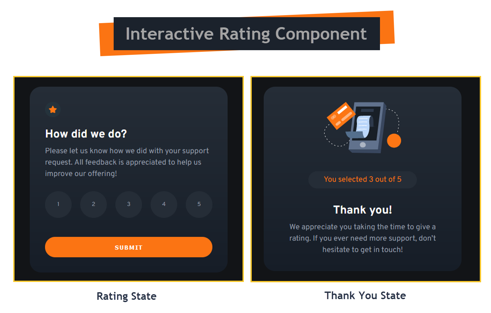

# Frontend Mentor - Interactive rating component solution

This is a solution to the [Interactive rating component challenge on Frontend Mentor](https://www.frontendmentor.io/challenges/interactive-rating-component-koxpeBUmI). Frontend Mentor challenges help you improve your coding skills by building realistic projects.

## Table of contents

- [Overview](#overview)
  - [The challenge](#the-challenge)
  - [Screenshot](#screenshot)
  - [Links](#links)
- [My process](#my-process)
  - [Built with](#built-with)
  - [What I learned](#what-i-learned)
  - [Continued development](#continued-development)
  - [Useful resources](#useful-resources)
- [Author](#author)

## Overview

### The challenge

Users should be able to:

- View the optimal layout for the app depending on their device's screen size
- See hover states for all interactive elements on the page
- Select and submit a number rating
- See the "Thank you" card state after submitting a rating

### Screenshot



### Links

- Solution: [Solution URL](https://github.com/ameneses67/interactive-rating-component)
- Live Site: [Live Site URL](https://ameneses67.github.com/interactive-rating-component/)

## My process

### Built with

- Semantic HTML5 markup
- CSS custom properties
- Flexbox
- Mobile-first workflow

### What I learned

I wasn't really sure how to permanently change the color of the selected rating, so I decided going for adding `class="active"` to the html element when it was clicked. But there was an issue with this solution, if you changed your mind and selected another rating, the previous rating didn't changed its color back to the original one.

So, the challenge to me was how change the color back if a new rating was selected before clicking the submit button.

I don't know if it is the optimal solution, but I created a function that loops all ratings choices and remove the _active_ class if it existed. Then I run the logic to add the _active_ class when a rating was clicked.

```js
rates.forEach((rate) => {
  rate.addEventListener("click", () => {
    removeActive(rates);
    rate.classList.add("active");
    selectedRate = rate.textContent;
  });
});

function removeActive(list) {
  list.forEach((el) => {
    el.classList.remove("active");
  });
}
```

### Continued development

Definitely I need to keep practicing JavaScript code.

### Useful resources

- [CSS Previous sibling selectors and how to fake them](https://medium.com/free-code-camp/how-to-make-the-impossible-possible-in-css-with-a-little-creativity-bd96bb42b29d) - This helped me to change the color of the previous sibling element when hovering the next one.

## Author

- Website - [Poncho](https://github.com/ameneses67)
- Frontend Mentor - [@ameneses67](https://www.frontendmentor.io/profile/ameneses67)
- Twitter - [@alfonso_meneses](https://www.twitter.com/alfonso_meneses)
